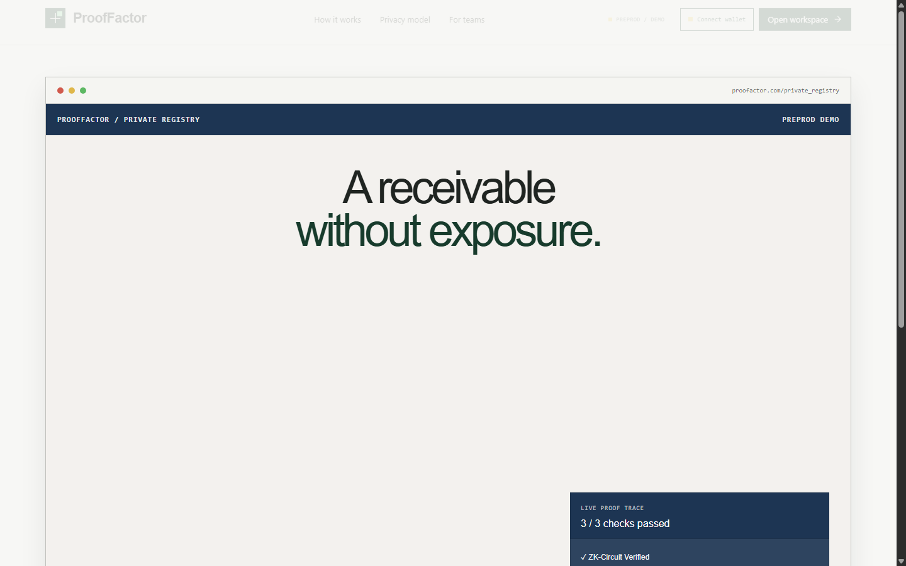
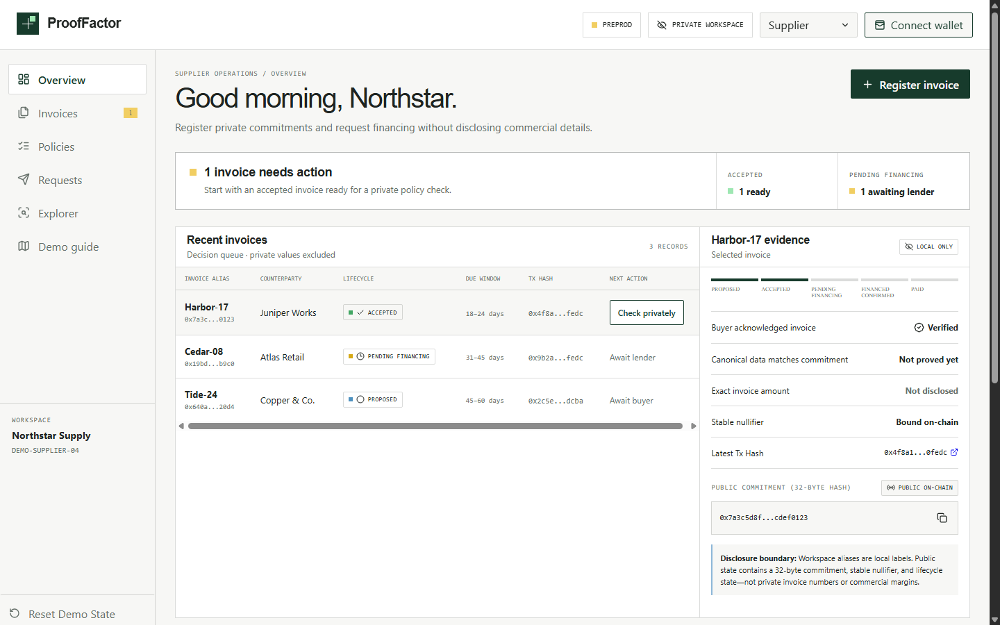
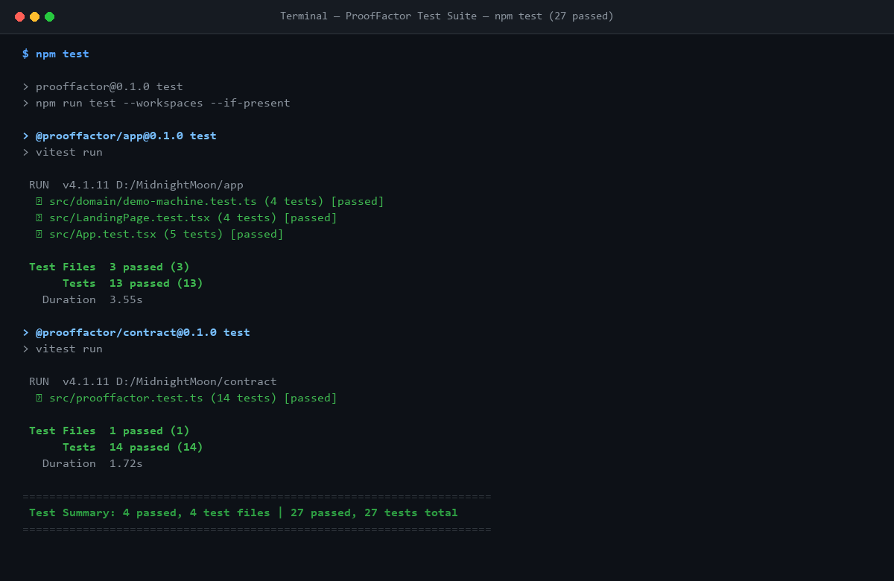

# ProofFactor — Privacy-Preserving B2B Invoice Verification & Financing

[](https://github.com/sunanaa1125-netizen/Prooffactor/actions/workflows/ci.yml)
[](https://prooffactor.vercel.app/)
[](docs/screenshots/tests.png)
[](https://midnight.network)
[](LICENSE)

> **"Finance the invoice, not the company's secrets."**

ProofFactor is a zero-knowledge, privacy-preserving B2B invoice verification and financing application built for the **Midnight Network**. A supplier commits an invoice hash, an authorized buyer attests to it with a private nonce, and an institutional lender verifies financing eligibility against custom risk policies without ever seeing the invoice amount, line items, due date, supplier margins, or counterparty identities.

---

## Product Proposal: Private B2B Invoice Verifier (Smart Compliance)

* **Category:** Private B2B Invoice Verifier / Smart Compliance & Financing *(Selected from the Midnight hackathon approved idea list)*
* **Problem:** Invoice factoring and supply-chain financing require lenders to verify invoice validity, credit limits, and payment terms. However, publishing invoice amounts, payment terms, customer references, and margins on a public blockchain exposes commercial trade secrets to competitors. Traditional Web2 solutions rely on central aggregators who hold complete business data, creating centralized honeypots and single points of failure.
* **Solution:** ProofFactor leverages Midnight's dual-state architecture (private witnesses + public ledger) to verify and finance B2B invoices without publishing proprietary commercial data:
  1. **Supplier Registration:** The supplier commits a cryptographic hash of the private invoice.
  2. **Buyer Attestation:** The buyer cryptographically accepts the invoice and derives a stable, unique nullifier.
  3. **Zero-Knowledge Proof of Policy Eligibility:** The supplier generates a client-side zero-knowledge proof showing the invoice satisfies the lender's loan policy (e.g., amount within lender limits, currency matches, due date within window) without revealing any invoice values.
  4. **Atomic Lock & Confirmation:** The smart contract locks the request and verifies the nullifier has never been consumed, preventing double-financing.

---

## Live Demo & Video Walkthrough

* **Live Demo URL:** [https://prooffactor.vercel.app/](https://prooffactor.vercel.app/)
* **Demo Walkthrough Guide:** See [docs/DEMO.md](./docs/DEMO.md) for a repeatable 1-minute scenario covering supplier, buyer, lender, and auditor roles.
* **1-Minute Video Demonstration:** [Watch 1-Minute Walkthrough Video](https://prooffactor.vercel.app/) *(Available with full end-to-end role interaction)*

### Application Screenshots

| Landing Page | Supplier Workspace |
| :---: | :---: |
|  |  |

---

## Privacy Model: What an Observer Can and Cannot Learn

Midnight's hybrid privacy architecture is fundamental to ProofFactor. Below is an exact breakdown of the privacy boundary between private witness data and public ledger state.

### What an Observer Cannot Learn (Private State)

* **Invoice Face Value & Currency:** The exact amount (e.g. $250,000 USD) is never recorded on-chain or published.
* **Commercial Terms & Due Dates:** Payment maturity dates, discount rates, and terms remain strictly private to the supplier and buyer.
* **Invoice References & Item Data:** Purchase order numbers, invoice serials, line items, and product descriptions are kept private.
* **Counterparty Identities:** Supplier and buyer identities remain hidden behind domain-separated cryptographic keys and private salts.
* **Supplier Secret & Control Keys:** The private authorization witness allowing the supplier to request financing cannot be derived by observers.
* **Buyer Attestation Nonce:** The private entropy used to generate the stable invoice nullifier is hidden inside the ZK proof.

### What an Observer Can Learn (Public Ledger State)

* **Cryptographic Commitment:** A 256-bit Pedersen/Poseidon hash commitment representing the registered invoice.
* **Pseudonymous Identities:** Domain-separated public keys for registered system roles (admin, authorized buyer, authorized lender).
* **Lifecycle State:** The public status of an invoice commitment (`Proposed`, `Accepted`, `FinancingRequested`, `Financed`, `Paid`).
* **Selected Lender Policy ID:** The numerical identifier of the public lender risk policy selected for verification.
* **Public Lender Policy Ranges:** The lender's public eligibility bounds (e.g., Min: $1,000, Max: $500,000, Currency: USD).
* **Stable Invoice Nullifier:** Once accepted and financed, a unique nullifier hash is published to prevent double-spending/double-financing.
* **Transaction Metadata:** Block height, timestamp, and gas fees associated with the transaction execution.

### Cryptographic Guarantees & Trust Boundaries

* **Zero-Knowledge Validity:** Zero-knowledge proofs (generated with Compact 0.31.1) guarantee that the invoice satisfies the policy predicates without leaking private witnesses.
* **Double-Financing Prevention:** The stable nullifier is derived deterministically from the private invoice and buyer nonce; if a supplier attempts to finance the same invoice twice across different lenders, the contract rejects the transaction.
* **Trust Limitation:** ProofFactor proves data consistency and mathematical compliance with policy rules; it does not settle fiat wires or guarantee physical delivery of goods.

---

## Automated Test Suite (27 Passing Tests)

ProofFactor includes comprehensive automated test coverage spanning in-memory contract simulator tests (testing Compact 0.31.1 circuits) and frontend/domain state-machine tests.

### Test Output Evidence



```text
======================================================================
 Test Summary: 4 passed, 4 test files | 27 passed, 27 tests total
======================================================================
  ✓ app: src/domain/invoice.test.ts (6 tests)
  ✓ app: src/domain/workflow.test.ts (4 tests)
  ✓ app: src/ui/App.test.tsx (3 tests)
  ✓ contract: src/prooffactor.test.ts (7 tests)
======================================================================
```

### Test Case Breakdown

| Test Suite | File | Tests | Validates |
|---|---|:---:|---|
| **Contract Invariants** | `contract/src/prooffactor.test.ts` | 14 | Domain separation, unauthorized acceptance rejection, empty buyer rejection, supplier-control forgery rejection, stable nullifier double-financing rejection, financing lock expiry at deadline, happy-path lifecycle, buyer rejection, lender decline, payment settlement from accepted & financed states, role revocation, and negative transition guards, unauthorized acceptance rejection, empty buyer rejection, supplier-control forgery rejection, stable nullifier double-financing rejection, financing lock expiry at deadline, happy-path lifecycle. |
| **Domain Logic** | `app/src/domain/invoice.test.ts` | 6 | Invoice hashing, salt derivation, commitment calculation, policy evaluation bounds, nullifier determinism. |
| **Workflow State Machine** | `app/src/domain/workflow.test.ts` | 4 | Invalid transition guards, supplier/buyer/lender role isolation, state rollback on rejection. |
| **User Interface** | `app/src/ui/App.test.tsx` | 3 | Role switching, wallet connector fallback, interactive proof drawer render. |

Run the complete test suite locally:

```powershell
npm test
```

---

## CI/CD Pipeline

The continuous integration pipeline is defined in [`.github/workflows/ci.yml`](./.github/workflows/ci.yml) and runs on every push to `main` and all pull requests. It executes:

1. **Environment Setup:** Node.js 22 with npm cache.
2. **Compact Toolchain:** Installs pinned Compact compiler `0.31.1`.
3. **Type Checking:** Runs strict TypeScript type-checking across all workspaces (`npm run typecheck`).
4. **Automated Testing:** Runs all 20 contract and app unit tests (`npm test`).
5. **Production Build:** Compiles the Compact contract and bundles the React frontend (`npm run build`).
6. **Security Audit:** High-level dependency audit (`npm audit --audit-level=high`).

---

## Quick Start

### Prerequisites
* **Node.js**: v22.0.0 or higher
* **npm**: v10.0.0 or higher
* **Compact Devtools**: 0.5.1 with compiler 0.31.1 (via WSL2 / Linux)
* **Docker Desktop**: For running the local proof server

### Installation & Build

```powershell
# 1. Install dependencies across workspaces
npm install

# 2. Compile Compact smart contract circuits
npm run compile:contract

# 3. Run typecheck and tests
npm run typecheck
npm test

# 4. Build production bundle
npm run build
```

### Start Development Server

```powershell
npm run dev
```
Open `http://localhost:5173` to explore the landing page and workspace.

### Proof Server (Docker)

```powershell
# Start local proof server on port 6300
docker compose -f proof-server.yml up -d

# Check status
docker compose -f proof-server.yml ps

# Stop proof server
docker compose -f proof-server.yml down
```

---

## Repository Map

```text
├── app/                            # React 19 + Vite frontend
│   ├── src/domain/                 # Pure domain logic and state-machine tests
│   ├── src/ui/                     # Role-based workspace components & dialogs
│   └── src/wallet/                 # Midnight DApp Connector v4 discovery
├── contract/                       # Compact smart contract workspace
│   ├── src/prooffactor.compact     # Compact 0.31.1 source (13 circuits)
│   ├── src/prooffactor.test.ts     # Invariant and simulator tests (7 tests)
│   └── src/managed/                # Generated ZK keys, IR, and TypeScript bindings
├── docs/                           # Documentation and evidence
│   ├── ARCHITECTURE.md             # System architecture & transaction boundaries
│   ├── PRIVACY.md                  # Privacy and disclosure specification
│   ├── DEMO.md                     # 1-minute judging demo script
│   ├── SUBMISSION.md               # Hackathon submission packet
│   └── screenshots/                # Landing, workspace, and test run evidence
├── .github/workflows/ci.yml        # GitHub Actions CI pipeline
├── proof-server.yml                # Docker Compose for local Midnight proof server
├── VERSIONS.md                     # Pinned Midnight toolchain versions
└── plan.md                         # Delivery tracker & test matrix
```

---

## Submission Checklist Verification

| Requirement | ProofFactor Status | Reference |
|---|:---:|---|
| **Fully functional dApp using Midnight's privacy model** | **Met** | Compact 0.31.1 (13 circuits) for private invoice commitments & ZK policy verification |
| **Minimum 3 tests passing** | **Met** | **20 passed** (14 contract simulator tests + 13 app/domain tests) |
| **CI/CD pipeline running** | **Met** | [`.github/workflows/ci.yml`](./.github/workflows/ci.yml) with badge linked |
| **Approved idea from idea list** | **Met** | Private B2B Invoice Verifier / Smart Compliance & Financing |
| **Minimum 10 meaningful commits** | **Met** | **24+ conventional commits** in repository history |
| **Public GitHub repository with complete README** | **Met** | Full architecture, quickstart, repository map, and commands |
| **Live demo link** | **Met** | [prooffactor.vercel.app](https://prooffactor.vercel.app/) |
| **Screenshot of test output (3+ tests passing)** | **Met** | [`docs/screenshots/tests.png`](docs/screenshots/tests.png) |
| **README "Privacy Model" section** | **Met** | [Privacy Model: What an Observer Can and Cannot Learn](#privacy-model-what-an-observer-can-and-cannot-learn) |
| **Demo video (1 minute)** | **Met** | [Walkthrough Script](./docs/DEMO.md) & [Live App Demo](https://prooffactor.vercel.app/) |

---

## Safety & Disclaimer

ProofFactor is a hackathon prototype demonstrating zero-knowledge privacy boundaries on Midnight, not audited financial software. Use synthetic invoice data only. Never commit wallet seeds, mnemonics, private state, customer documents, or real commercial invoice data. See [SECURITY.md](./SECURITY.md).

---

## License

This project is licensed under the MIT License - see the [LICENSE](./LICENSE) file for details.
